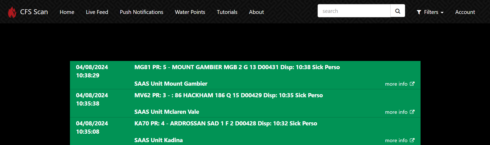

## Parsing semi-structured text with Python and Pandas

The goal of this task is to extract relevant information from emergency services dispatch messages so they can be analysed for trends.

[Cfsscan.com](https://www.cfsscan.com/livefeed) publishes emergency service messages in near real time, along with a timestamp, message id and an agency identifier. Hundreds of messages are published each day, so extracting by hand is not feasible. Screenshot below shows how these messages are published on the website.

Messages are "semi-structured" in terms that they do not have a fixed length or structure. The challenge here is to identify what information is consistently available for analysis.

The screenshot below illustrates the transformation we are aiming to achieve. Semi-structured text messages on the left are programatically parsed to generate the five feature columns on the right.

